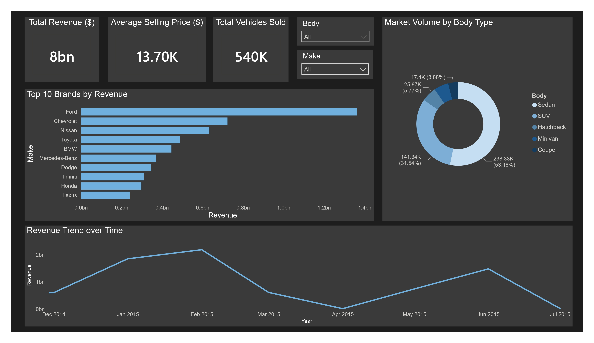
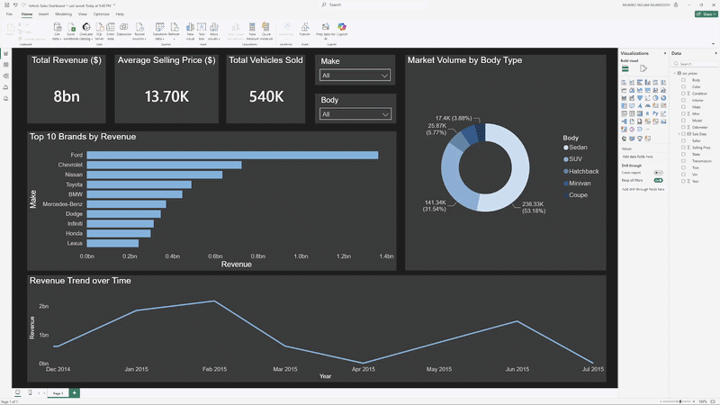

# Wholesale Vehicle Sales & Market Analysis 🚗📊

## Project Overview
This Business Intelligence project analyzes over 550,000 wholesale vehicle transactions to extract actionable market share, revenue trends, and brand performance insights. Designed for B2B automotive stakeholders, the dashboard processes **$8 Billion** in total revenue across a highly volatile secondary market.

**Author:** Muayad
**Tech Stack:** Power BI, Power Query (M Language), DAX, Data Modeling

## 🛠️ Data Engineering & Architecture
Raw financial datasets are rarely presentation-ready. A significant portion of this project was dedicated to backend data cleaning, transformation, and logic structuring to ensure 100% mathematical accuracy.

**Key Technical Implementations:**
*   **Timezone & Temporal Standardization:** Surgically extracted corrupted text strings (e.g., `GMT`) from unstructured Datetime columns to successfully build a continuous, error-free Time Intelligence calendar.
*   **Mojibake (Encoding Error) Remediation:** Identified and standardized character encoding anomalies (`—`) within categorical columns into 'Unknown' values, preventing the loss of critical row-level revenue data.
*   **Advanced Aggregation Logic:** Transitioned default text-string behaviors into `Count (Distinct)` DAX aggregations to ensure accurate tracking of individual Vehicle Identification Numbers (VINs), preventing data duplication in market share calculations.
*   **Top N Filtering & Noise Reduction:** Streamlined categorical visuals by filtering out statistical noise (90+ rare car brands), isolating the Top 10 revenue-generating manufacturers to maximize the dashboard's Data-Ink ratio.

## 📈 Key Business Insights
By structuring the cleaned data into an executive-level layout, several key market behaviors became immediately visible:

1.  **Revenue Dominance:** **Ford** and **Chevrolet** hold a commanding lead in the wholesale market, significantly outpacing imported luxury brands in sheer volume and total sales.
2.  **Market Share by Body Type:** Consumer and dealership preference heavily favors practical utility. **Sedans (238K units)** and **SUVs (141K units)** combined control over **84% of the total vehicle market volume**.
3.  **Revenue Volatility:** The temporal timeline reveals that wholesale transactions are not uniform; a massive sales peak occurred in early 2015, establishing a critical baseline for forecasting future quarterly performance.

## 💻 Interactive Demonstration
*(Below is a demonstration of the dashboard's cross-filtering capabilities, allowing executives to isolate market trends by specific vehicle makes or body types.)*

---
*This project demonstrates end-to-end data pipeline proficiency, from raw ETL (Extract, Transform, Load) processing to executive UX/UI visualization.*
